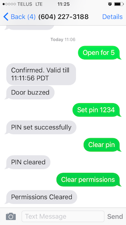

# DoorBuzzer

This cloud-based service manages door-buzzer systems commonly found at the entrance of apartment buildings around Vancouver. Typically the intercom call is forwarded to a phone number, which could be the resident's cell phone. This interface can lead to friction if keeping a phone on-hand seems inconvenient, or if the access is meant to be shared among multiple persons.

Perhaps you're expecting a friend or a food delivery within 30 minutes, this allows you to set temporary permissions for an arbitrary time period by sending a text message to the service: `Open for 30`.



## Features

The system is a simple Python application that interfaces with Twilio's (telephony) REST API. It is intended for a single deployment, so there is no backend databases.

* the system will only accept commands from an authorized set of admins
* when someone buzzes through the system, it notifies (via SMS) whichever admins have granted permission
* supports access-PIN scheme (`Set pin 1234`, `Clear pin`)

## Installation

```terminal
pip install -r requirements.txt
python app.py
```

### Virtualenv

```terminal
sudo pip install virtualenv
virtualenv venv
source venv/bin/activate
```

